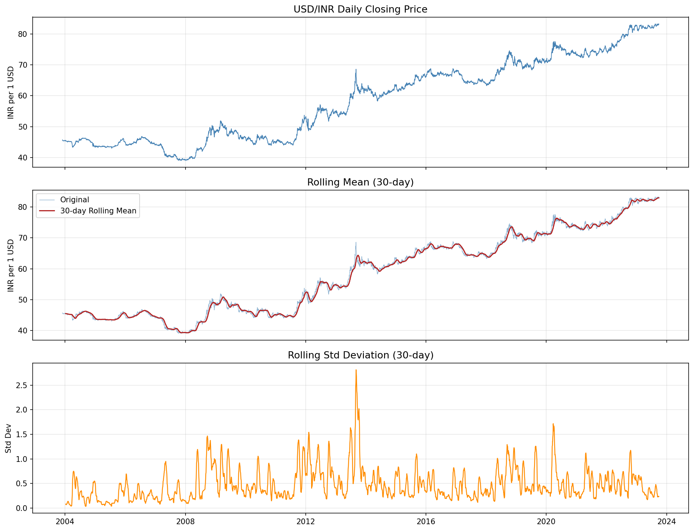
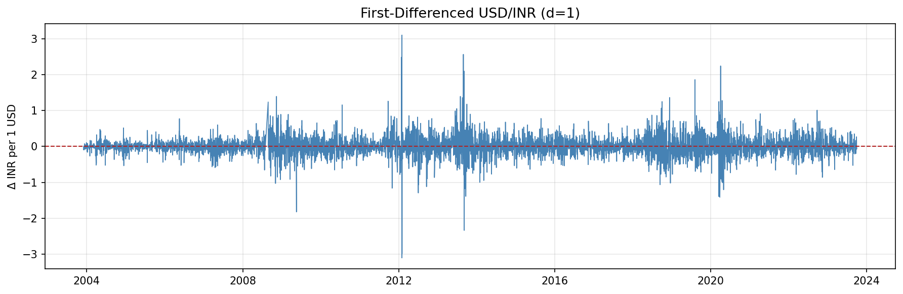
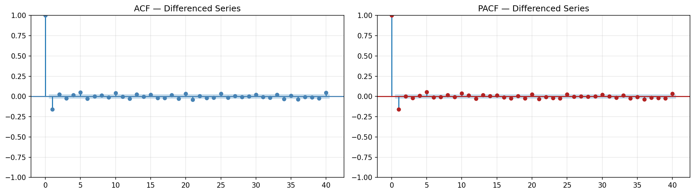
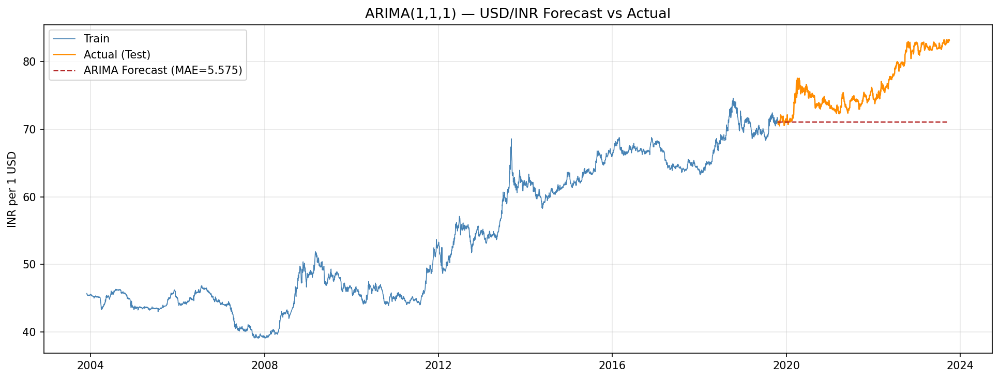
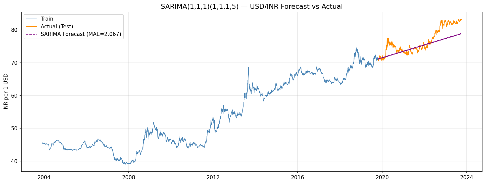
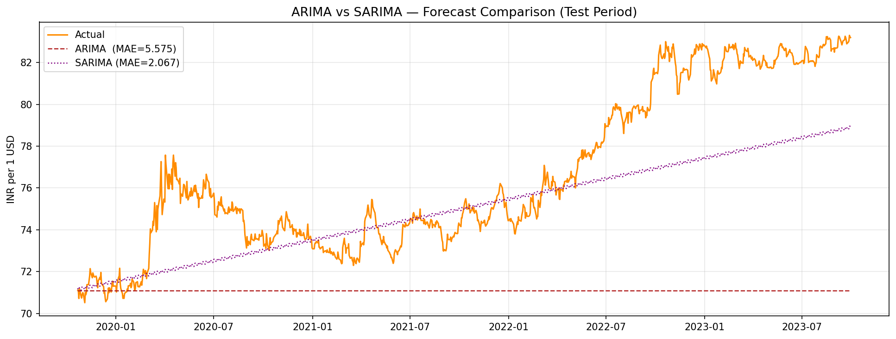
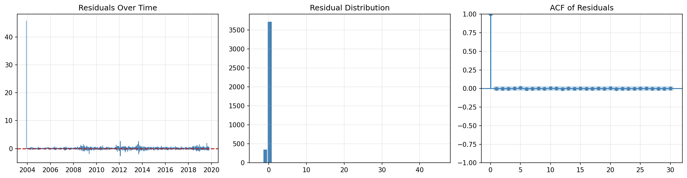

# Python · Statistics & Data Science Projects

> A collection of original statistical analysis and data science projects by Ayush Seth, final-year B.Sc. (Hons.) Statistics student at Hindu College, University of Delhi.

---

## Projects

| # | Project | Type | Key Methods |
|---|---------|------|-------------|
| 1 | [Digit Distribution of Euler's Partition Function](#1-digit-distribution-of-eulers-partition-function-pn) | Original Research · B.Sc. Dissertation | Chi-Square, KS, Anderson-Darling |
| 2 | [USD/INR Exchange Rate Forecasting](#2-usdinr-exchange-rate-forecasting-with-arima--sarima) | Time Series Analysis | ARIMA, SARIMA, ADF, ACF/PACF |
| 3 | [Snake & Ladder + Word Hangman](#3-python-mini-games) | Programming Practice | OOP, game logic, file I/O |

---

## 1. Digit Distribution of Euler's Partition Function p(n)

**B.Sc. Dissertation · Presented at the International Conference on Exploring Mathematics and Allied Areas, National Mathematics Resource Centre, Hindu College, April 2026.**

### Overview

The integer partition function p(n) counts the number of ways a positive integer n can be written as a sum of positive integers. This project investigates whether the base-10 digits of p(n) — across all values n = 0 to 10,000 — follow a uniform distribution, or whether a hidden structural bias exists.

**Key result:** All three goodness-of-fit tests conclusively reject uniformity at the 5% significance level across **703,634 extracted digits**.

### Results

| Test | Statistic | Critical Value (α=0.05) | Decision |
|------|-----------|--------------------------|----------|
| Pearson Chi-Square | 124.15 | 16.92 (df=9) | **REJECT H₀** |
| Kolmogorov-Smirnov | 0.004223 | 0.001621 | **REJECT H₀** |
| Anderson-Darling | 144,093 | 2.492 | **REJECT H₀** |

### Digit Frequency Table

| Digit | Observed | Expected | Deviation |
|-------|----------|----------|-----------|
| 0 | 70,128 | 70,363 | −235 |
| 1 | 72,606 | 70,363 | **+2,243** |
| 2 | 71,150 | 70,363 | +787 |
| 3 | 70,155 | 70,363 | −208 |
| 4 | 70,136 | 70,363 | −227 |
| 5 | 70,977 | 70,363 | +614 |
| 6 | 69,694 | 70,363 | −669 |
| 7 | 69,991 | 70,363 | −372 |
| 8 | 69,635 | 70,363 | −728 |
| 9 | 69,162 | 70,363 | **−1,201** |

Digit **1** is overrepresented and digit **9** is underrepresented — consistent with Benford's Law effects in rapidly growing sequences.

### Methodology

- Implemented **Euler's Pentagonal Number Theorem** from scratch in pure Python — exact integer arithmetic, zero floating-point error
- Computed p(n) for all n ≤ 10,000; p(10,000) itself is a 107-digit integer
- Extracted all base-10 digits from all 10,001 values (703,634 digits total)
- Applied three independent goodness-of-fit tests against the uniform null hypothesis

### Files
```
partition_digit_analysis.py   # Full analysis: computation + all three tests
```

### How to Run
```bash
pip install numpy scipy
python partition_digit_analysis.py
```

---

## 2. USD/INR Exchange Rate Forecasting with ARIMA & SARIMA

**Coursework Project · Hindu College, University of Delhi · Aug–Sep 2023**

### Overview

Forecasting daily USD/INR exchange rates using classical time series models, evaluated on a held-out test window using Mean Absolute Error (MAE).

| Model | Order | MAE (Test Set) |
|-------|-------|----------------|
| ARIMA | (1,1,1) | 5.575 INR |
| **SARIMA** ✓ *(winner)* | (1,1,1)(1,1,1,5) | **2.067 INR** |

SARIMA reduced MAE by ~63% over the baseline, demonstrating that weekly trading-day seasonality (s=5) is a significant driver of short-term USD/INR dynamics.

### Visualisations

#### Raw Series & Rolling Statistics


#### First-Differenced Series (d=1)


#### ACF & PACF — Differenced Series


#### ARIMA(1,1,1) — Forecast vs Actual


#### SARIMA(1,1,1)(1,1,1,5) — Forecast vs Actual


#### Model Comparison


#### Residual Diagnostics


### Methodology
- **Data:** Yahoo Finance (`INR=X`), Dec 2003 – Sep 2023, ~20 years of daily closes
- **Stationarity:** ADF test confirmed non-stationarity in levels; stationary after first differencing
- **Model selection:** ACF/PACF analysis → ARIMA(1,1,1); seasonal extension with s=5 trading days
- **Evaluation:** 80/20 train/test split, MAE on held-out window, Ljung-Box residual test

### Files
```
USD_INR_Forecasting.ipynb   # Full analysis notebook
Prediction_Model.py         # Core modelling script
X.csv                       # Dataset (USD/INR closing prices)
eda_plot.png
differenced_series.png
acf_pacf.png
arima_forecast.png
sarima_forecast.png
model_comparison.png
residual_diagnostics.png
```

### How to Run
```bash
pip install yfinance pandas matplotlib statsmodels scikit-learn
jupyter notebook USD_INR_Forecasting.ipynb
```

---

## 3. Python Mini Games

**Programming practice — core Python concepts**

### Snake & Ladder
Classic 1-player terminal game with a 100-square board, random dice rolls, and snake/ladder position effects.

```bash
python snake_n_ladder_1.py
```

### Word Hangman
Word-guessing game with random word selection from a word bank. Tracks guessed letters and remaining attempts.

```bash
python word_trivia.py
```

**Concepts covered:** dictionaries, random module, file I/O, string manipulation, game loop design, win detection.

---

## Repository Structure

```
Python-Repo/
│
├── partition_digit_analysis.py   # Project 1 — Partition function + 3 tests
│
├── USD_INR_Forecasting.ipynb     # Project 2 — Full forecasting notebook
├── Prediction_Model.py           # Project 2 — Modelling script
├── X.csv                         # Project 2 — Dataset
├── eda_plot.png
├── differenced_series.png
├── acf_pacf.png
├── arima_forecast.png
├── sarima_forecast.png
├── model_comparison.png
├── residual_diagnostics.png
│
├── snake_n_ladder_1.py           # Project 3 — Snake & Ladder
├── word_trivia.py                # Project 3 — Word Hangman
├── word5.txt
├── word6.txt
├── word7.txt
│
└── README.md
```

---

## Tech Stack

| Library | Purpose |
|---------|---------|
| `numpy`, `scipy` | Statistical tests (Chi-Square, KS, AD) |
| `yfinance` | Market data download |
| `pandas` | Data manipulation |
| `matplotlib` | Visualisation |
| `statsmodels` | ARIMA / SARIMA modelling |
| `sklearn` | MAE evaluation |

---

## Author

**Ayush Seth**
B.Sc. (Hons.) Statistics, Hindu College, University of Delhi
GATE 2026 AIR 226 · JAM 2026 AIR 292
[linkedin.com/in/sethayush](https://linkedin.com/in/sethayush) · sethayush1466@gmail.com
